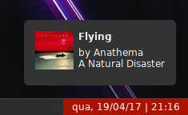

# Musnify-mpd

**Musnify** is a simple script written in python that provides notification support for [Music Player Daemon](https://github.com/MaxKellermann/MPD) using _libnotify_0.7_.
It can also display the album covers loaded from _last.fm_ in the notification status or load it from the user local music library.

## Dependencies
To use musnify-mpd you will need to install the following python dependencies:

    # pip2 install requests mpd

## Installation

To install musnify-mpd simple clone this repository into your machine:

    $ git clone https://github.com/felipemarinho97/musnify-mpd.git
And so run the install.sh script inside the cloned directory.

    $ cd musnify-mpd   
    # ./install.sh
    
#### Arch Linux
If you are a Arch Linux user, you can also install it directly from [AUR](https://aur.archlinux.org/packages/musnify-mpd):

    $ yaourt -S musnify-mpd

## Configuration

After installation you may want to configure your _mpd_ host and port, to do this copy the .example file into ~/.config/musnify-mpd

    $ mkdir ~/.config/musnify-mpd
    $ cp /usr/share/doc/musnify-mpd/musnify-mpdconfig.example ~/.config/musnify-mpd/musnify-mpd.config

There is a sample conf:

    [mpd]
    host = localhost
    port = 6600
    musiclibrary = ~/Music
    [apiKey]
    lastfm = YOUR_LASTFM_API_KEY

You always can just specify your MPD host and port:

    $ musnify-mpd -h MPD_HOST -p MPD_PORT

## Use
Just remember to run the script "musnify-mpd" every time you start your WM by putting
it on your _autostart_ or _rc.d_ file and enjoy it. 😄

## Author
Felipe Marinho
<felipevm97@gmail.com>

If you have any suggestions please fell free to contact-me.
